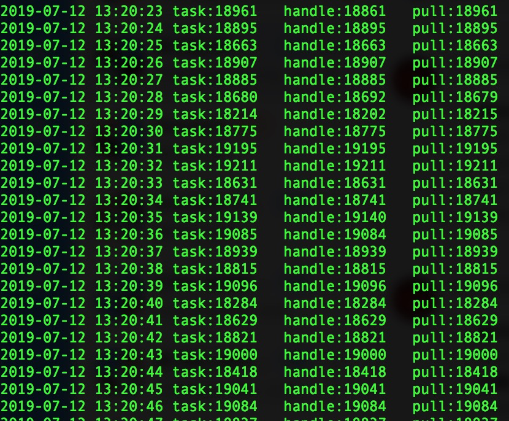

## Queue Job
基于Go语言实现的队列调度服务

## Features
- 非侵入式的Queue接口设计，解耦队列调度服务与Queue驱动，Queue驱动自行扩展实现；
- 简洁易用的Worker注册机制，开发只需要关心业务逻辑的实现；
- 支持worker任务事件注册回调:处理前、处理后、panic；
- 支持平滑关闭和超时退出机制；
- 支持简单的消息入队调用；

## Get started

### New service
```
j = job.New()
```

### Register worker
```

//设置worker的相关队列, 设置任务投递回调函数和并发数
j.AddFunc(queue, "topic:test1", test, 2)
//使用worker结构进行注册
w, _ := j.NewWorkerWithFunc(queue, "topic:test2", test, 1)
j.AddWorkerWithFunc(w)
```

### Register event
```
//任务处理前的回调函数
j.RegisterTaskBeforeCallback(task *Task)
//任务处理后的回调函数
j.RegisterTaskAfterCallback(task *Task)
//任务处理触发panic的回调函数
j.taskPanicCallback(task *Task, e ...interface{})
```

### How to start
```
j.Start()
```

### How to stop
停止服务只会影响队列消费，不会影响消息入队的调用
```
//将服务设置为停止状态
//j.Stop()

//waitStop会等待worker任务跑完后停止当前服务。
//第一个参数为超时时间，如果无法获取到worker全部停止状态，在超时时间后会return一个超时错误
//job.WaitStop(time.Second * 3)
```

### Get stats
```
//获取运行态统计数据
j.Stats()
```

### Enqueue
```
//消息入队
job.Enqueue(ctx context.Context, topic string, message string, args ...interface{})
//消息入队以Task数据结构
job.EnqueueWithTask(ctx context.Context, topic string, task work.Task, args ...interface{})
//消息批量入队
job.BatchEnqueue(ctx context.Context, topic string, messages []string, args ...interface{})
//消息批量入队以Task数据结构
job.BatchEnqueueWithTask(ctx context.Context, topic string, tasks []work.Task, args ...interface{})
```

## Bench
### Condition
设置worker并发度100，worker模拟耗时0.005ms，本地队列100W数据。

### Run
```golang
go run example/example.go
```

### Result
稳定在19000tps左右（100并发+耗时0.005ms的极限是20000tps），损耗几乎集中在内存队列操作的耗时(本地内存队列没好好实现)，本身实现的损耗非常小。

### Picture of result
pull表示从Queue驱动拉取的消息数，task表示任务分发数，handle表示任务处理数  



### How to calculate speed
1s/(队列驱动单次拉取数据耗时+worker单任务处理耗时) * worker并发数

## More

### A Demo
```text
example/job.go
```
